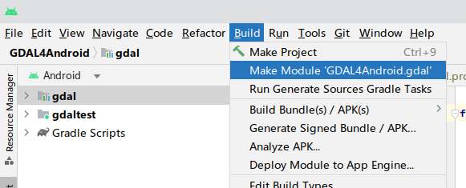

# GDAL4Android

This project builds GDAL into an [Android Archive(AAR)](https://developer.android.com/studio/projects/android-library) file. So you can use GDAL's functionality in your Android App.

Version Info: GDAL 3.7.0, PROJ 9.2.1, SQLITE 3.42.0, EXPAT 2.5.0(used for kml support)

[DOWNLOAD AAR file](https://github.com/kikitte/GDAL4Android/releases)


### Build with Docker

This project provides a Dockerfile which you can build a docker image which is suitable to build GDAL4Android without environment problems. Below is some examples about how you can build GDAL4Android with docker.

```bash
# Note: don't forgot to install docker.

cd <your-workspace-path>
git clone https://github.com/kikitte/GDAL4Android.git
cd GDAL4Android

# this step produces an image named gdal4android_builder_img
docker build -t gdal4android_builder_img - < docker/Dockerfile

# this step runs a container so you can build GDAL4Android within it.
docker run -it --name gdal4android_builder -v .:/root/GDAL4Android gdal4android_builder_img

# Note: You are now in the container environment, /root/GDAL4Android is the project root directory in the container.

# override the default FindJNI.cmake, 
cp /root/GDAL4Android/docker/cmake_modules/FindJNI.cmake /usr/share/cmake-3.22/Modules/FindJNI.cmake

# change working direction to the project root direcory
cd /root/GDAL4Android

# build gdal aar, the output aar file is in: GDAL4Android/gdal/build/outputs/aar/gdal-release.aar
./gradlew :gdal:assembleReleas
# build gdaltest apk, the output apk fiel is in: GDAL4Android/gdaltest/build/outputs/apk/debug/gdaltest-debug.apk
./gradlew :gdaltest:assembleDebug
```

### Building Requirements

- Linux

  bash

  some utilities: getconf & make & cmake & libtool & ant & ...

  swig: for building gdal java bindings.

- Android Studio 2022.2 or newer

  with latest ndk installed, r25c or newer

  use Android Studio default JDK as Gradle JDK (specified in Gradle settings)

You may encounter problems caused by development environment, if something is missing, just install it.

### Building Processes

Just select gdal module in the project panel and make it from the build menu. The output arr file is located at gdal/build/outputs/aar/gdal-release.aar.



You can also download the build version in the release page.

### Credit

https://github.com/OSGeo/gdal/blob/master/.github/workflows/android_cmake/start.sh

https://github.com/paamand/GDAL4Android
